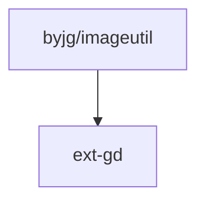

# ImageUtil Library

[](https://github.com/byjg/php-imageutil/actions/workflows/phpunit.yml)
[](http://opensource.byjg.com)
[](https://github.com/byjg/php-imageutil/)
[](https://opensource.byjg.com/opensource/licensing.html)
[](https://github.com/byjg/php-imageutil/releases/)

ImageUtil is a PHP library that provides a collection of operations for image manipulation using the GD library.
It simplifies tasks such as flipping, cropping, resizing, stamping, and more.

## Installation

To install ImageUtil, use the following composer command:

```bash
composer require "byjg/imageutil"
```

## Supported Formats

ImageUtil supports the following image formats:

- GIF
- JPEG
- PNG
- BMP
- WEBP
- SVG (Partial support. Primarily for converting SVG to other formats, not for SVG manipulation.)

## Creating an Image

You can create an image from a file, URL, existing resource, or create an empty image:

```php
<?php
use ByJG\ImageUtil\ImageUtil;
use ByJG\ImageUtil\Color;
use ByJG\ImageUtil\Enum\FileType;

// From a file
$img = ImageUtil::fromFile('path_to_image.png');

// From a URL
$img2 = ImageUtil::fromFile('https://somesite/someimage.jpg');

// From an existing resource image
$resourceImg = imagecreatetruecolor(200, 300);
$img3 = ImageUtil::fromResource($resourceImg);

// Or an empty image
$img4 = ImageUtil::empty(200, 300, FileType::Png, new Color(255, 255, 255));
```

## SVG Files

:::caution
ImageUtil provides basic support for SVG files, primarily for converting SVG images to other GD-supported formats.
It does not support all SVG features and does not support operations like resize, flip, etc.
:::

```php
<?php
use ByJG\ImageUtil\ImageUtil;

$img = ImageUtil::fromFile('path_to_image.svg');
$img->save('path_to_image.png');
```

## Image Manipulation

ImageUtil provides several methods for image manipulation:

- **Flip**: Mirror the image vertically or horizontally.
- **Rotate**: Rotate the image by a specified angle.
- **Resize**: Resize the image to specified dimensions.
- **Resize Square**: Resize the image to a square format while maintaining the aspect ratio. Any extra space is filled with the provided RGB color.
- **Resize AspectRatio**: Resize the image while maintaining the aspect ratio. Any extra space is filled with the provided RGB color.
- **Stamp Image**: Stamp another image onto the current image.
- **Write Text**: Write text onto the image.
- **Crop Image**: Crop the image from a specified point to another point.
- **Make Transparent**: Make the image transparent. The transparent color must be provided.

See detailed examples [here](docs/examples.md).

## Saving and Restoring Changes

You can save the changes to the image or restore the image to its original state:

```php
<?php
use ByJG\ImageUtil\ImageUtil;

$img = ImageUtil::fromFile('wheel.png');
$img->resize(640, 480);

// Save to file
$img->save('filename.gif');

// Restore to original state
$img->restore();
```

## Other Functions

ImageUtil also provides methods to get the image dimensions and the image resource:

```php
<?php
use ByJG\ImageUtil\ImageUtil;

$img = ImageUtil::fromFile('wheel.png');

$width = $img->getWidth();
$height = $img->getHeight();
$resource = $img->getResource();
```

## Dependencies

ImageUtil depends on the GD extension for PHP:



----
[Open source ByJG](http://opensource.byjg.com)
