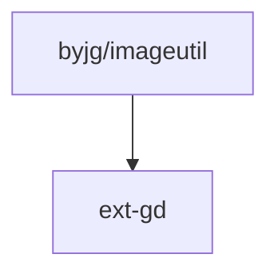

# ImageUtil

[](https://github.com/byjg/php-imageutil/actions/workflows/phpunit.yml)
[](http://opensource.byjg.com)
[](https://github.com/byjg/php-imageutil/)
[](https://opensource.byjg.com/opensource/licensing.html)
[](https://github.com/byjg/php-imageutil/releases/)

A wrapper collection for GD library in PHP. Defines a set of methods for flip, crop, resize, stamp and others easily.

## Installation

```
composer require "byjg/imageutil"
```


## Creating the Image

```php
<?php
// From the file system
$img = new ImageUtil('path_to_image.png');

// From an URL
$img2 = new ImageUtil('http://somesite/someimage.jpg');

// From an existing resource image
$resourceImg = imagecreatetruecolor(200, 300);
$img3 = new ImageUtil($resourceImg);

// Or empty image
$img4 = ImageUtil::empty(200, 300, new Color(255, 255, 255));
```

## Flip an image

Mirrors the given image in the desired way.i

```php
<?php
$img = new ImageUtil('wheel.png');
$img->flip(Flip::Vertical)->resize(120, null)->save('wheel.jpg');
```

## Rotate

Rotates the image to any direction using the given angle.

```php
<?php
$img = new ImageUtil('wheel.png');
$img->rotate(45);
```

## Resize

Resize the image to an new size. Size can be specified in the arguments.

```php
<?php
$img = new ImageUtil('wheel.png');
$img->resize(640, 480);
```

## Resize Square

Resize the image into a square format and maintain the aspect ratio. The spaces left are filled with the RGB color provided.

```php
<?php
$img = new ImageUtil('wheel.png');
$img->resizeSquare(200);
```

## Resize and maintain the AspectRatio

Resize the image but the aspect ratio is respected. The spaces left are filled with the RGB color provided.

```php
<?php
$img = new ImageUtil('wheel.png');
$img->resizeAspectRatio(200, 150)
```

## Stamp Image

Stamp an image in the current image.

```php
<?php
$img = new ImageUtil('wheel.png');
$stamp = new ImageUtil('https://www.mysite.com/logo.png');
$img->stampImage($stamp, StampPosition::BottomRight);
```

## Write Text

Writes a text on the image.

```php
<?php
$img = new ImageUtil('wheel.png');
$img->writeText('Sample', 0, 70, 45, 'Arial');
```

## Crop Image

Crops the given image from the ($from_x,$from_y) point to the ($to_x,$to_y) point.

```php
<?php
$img = new ImageUtil('wheel.png');
$img->crop(250,200,400,250);
```

## Make Transparent

Make the image transparent. The transparent color must be provided.

```php
<?php
$img = new ImageUtil('wheel.png');
$img->makeTransparent(new Color(255, 255, 255));
```

## Restoring the changes

```php
<?php
$img->restore();
```

## Destroy the resouce

```php
<?php
$img->destroy();
```

## Saving the Image

```php
<?php
$img->save('filename.gif')
```

## Other functions

```php
<?php
// Get the image dimension
$witdh = $img->getWidth();
$height = $img->getHeight();

// Get the image resource
$resource = $img->getImage();
````

## Dependencies



----
[Open source ByJG](http://opensource.byjg.com)